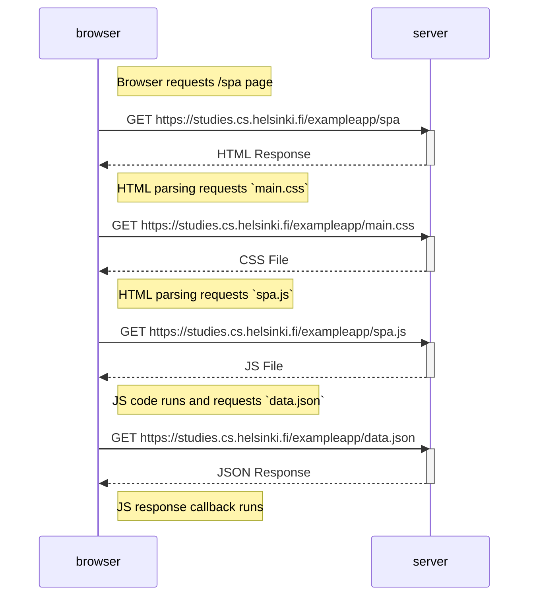

# Exercise 0.5

Make a diagram for request flows of visiting https://studies.cs.helsinki.fi/exampleapp/spa

```mermaid

sequenceDiagram
    participant browser
    participant server

    note right of browser: Browser requests /spa page

    browser->>server: GET https://studies.cs.helsinki.fi/exampleapp/spa
    activate server
    server-->>browser: HTML Response
    deactivate server

    note right of browser: HTML parsing requests `main.css`

    browser->>server: GET https://studies.cs.helsinki.fi/exampleapp/main.css
    activate server
    server-->>browser: CSS File
    deactivate server

    note right of browser: HTML parsing requests `spa.js`

    browser->>server: GET https://studies.cs.helsinki.fi/exampleapp/spa.js
    activate server
    server-->>browser: JS File
    deactivate server

    note right of browser: JS code runs and requests `data.json`

    browser->>server: GET https://studies.cs.helsinki.fi/exampleapp/data.json
    activate server
    server-->>browser: JSON Response
    deactivate server

    note right of browser: JS response callback runs

```
