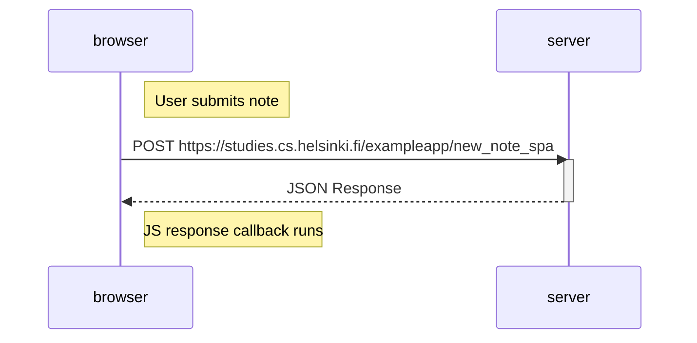

# Exercise 0.6

Make a diagram for request flows of creating a note in https://studies.cs.helsinki.fi/exampleapp/spa

```mermaid

sequenceDiagram
    participant browser
    participant server

    note right of browser: User submits note

    browser->>server: POST https://studies.cs.helsinki.fi/exampleapp/new_note_spa
    activate server
    server-->>browser: JSON Response
    deactivate server

    note right of browser: JS response callback runs

```
